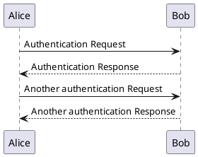

<script>
  import {QueryType} from "@edraj/tsdmart";
  import ListView from "@/lib/ListView.svelte";
</script>

# Widgets

This skeleton project comes with a few widgets that you can use to interact with the DMART API.

## List view

You can do a full text search or an attribute based search for that field.
for example, lets say we want to retrieve all sub-folders under **mysapce** space

We call the `/query` API with the following request body:

```json
{
  "filter_shortnames": [],
  "type": "search",
  "search": "",
  "space_name": "myspace",
  "subpath": "/",
  "exact_subpath": true,
  "limit": 15,
  "offset": 0,
  "retrieve_json_payload": true,
  "sort_type": "ascending",
  "sort_by": "created_at"
}
```

And the results would be:

<ListView
    type={QueryType.search}
    space_name={"myspace"}
    subpath={"/"}
    scope={"public"}
/>

And you can also add a search bar for the list view:

<ListView
    type={QueryType.subpath}
    space_name={"myspace"}
    subpath={"/"}
    isSearchable={true}
    scope={"public"}
/>

Or with a predefined search text:
<ListView
    type={QueryType.search}
    space_name={"myspace"}
    subpath={"/"}
    searchValue={"test"}
    scope={"public"}
/>

## Plant UML

A plant uml diagram:

